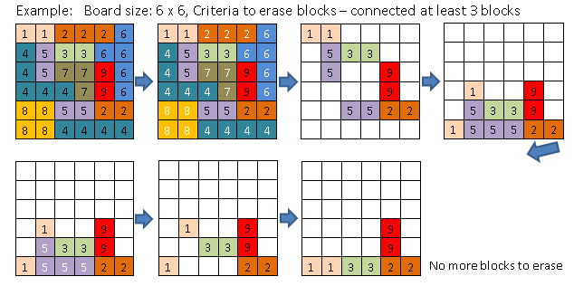
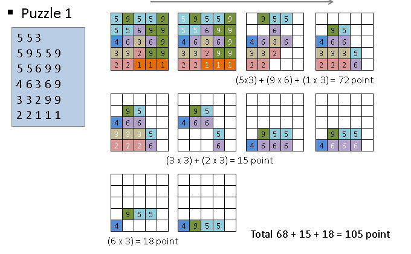

Compile C file using cl block-john.c
then run test data with usage:
block-john (filename.txt)

ex:

block-john sample.txt

Assignment
1. At the beginning, the puzzle board is filled with blocks with number 1 to 9. 
2. Size of the board and blocks data are provided by the input test data.
3. Based on the minimum number of connected blocks with same number required to erase, erase the blocks. All erasable blocks are erased from the puzzle board.  If there’s no block to erase, then proceed to step 6
4. Remaining blocks fall down by gravity if there’s any empty spaces underneath.
5. Once all blocks are fallen down, go back to step 3.
6. When you erase connected blocks, you get score based on the number of the block and the number of  connected blocks.   For example, if the blocks above are erased, it scores 5 x 4 = 20 point.
7. At the end of a puzzle, display the final blocks and total point you got from the puzzle.

